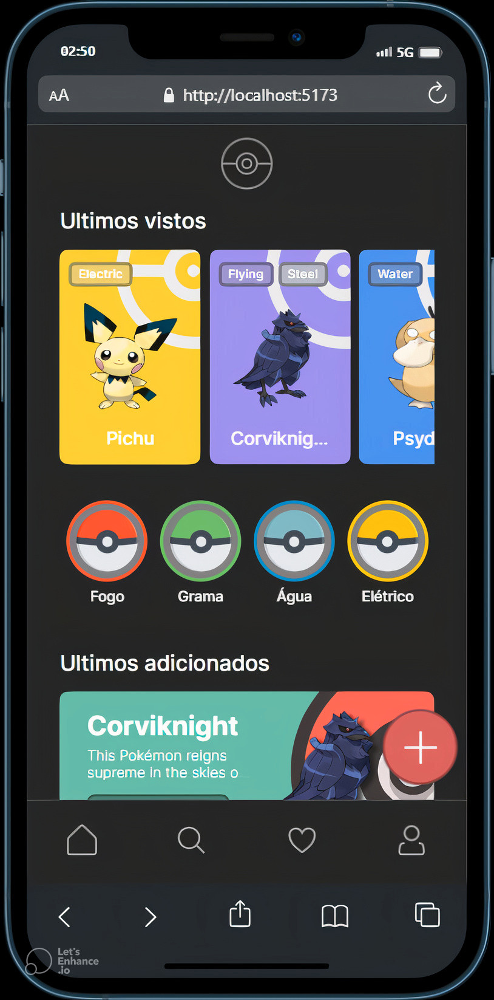
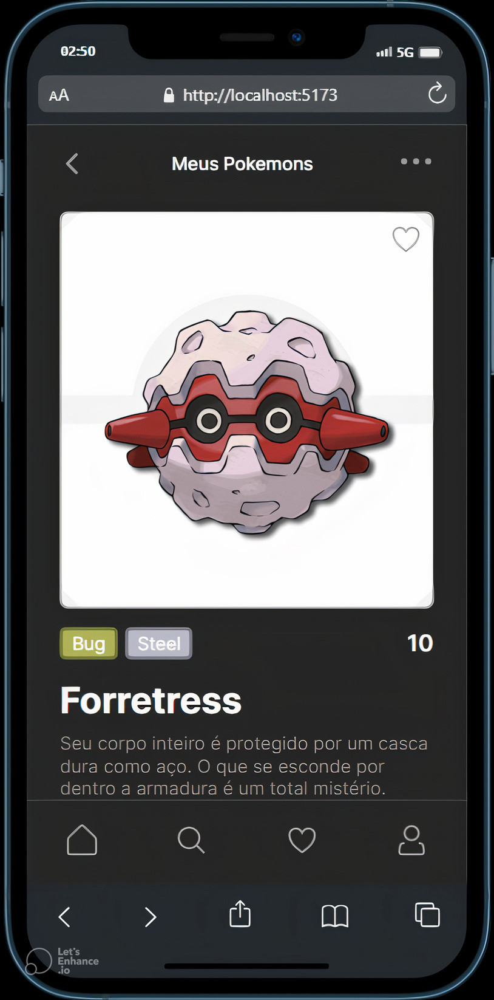
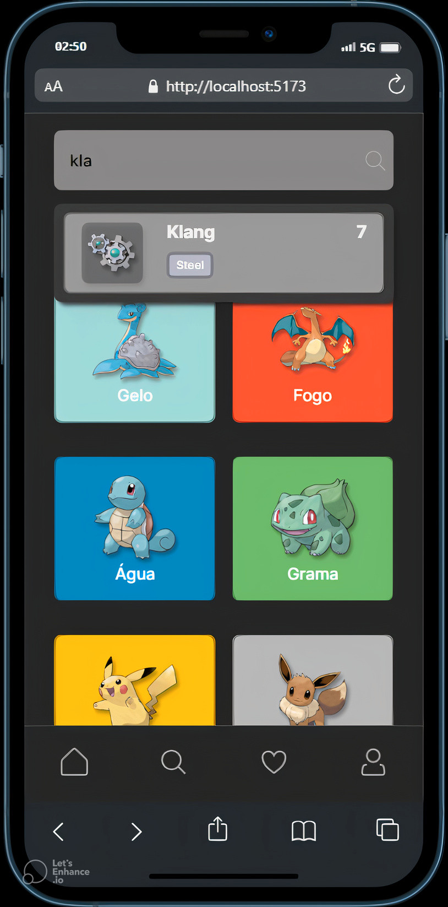

<h1>PokeHub</h1>

PokeHub é uma aplicação full-stack que permite gerenciar informações sobre os pokemons. A aplicação consiste em uma API em Node.js com TypeScript, que consome os dados da POKEAPI e armazena-os, juntamente com uma interface visual desenvolvida em React.js, também com TypeScript..

<h2>Funcionalidades</h2>

<ul>
  <li>Visualizar informações sobre pokemons, incluindo detalhes, estatísticas e habilidades.</li>
  <li>Favoritar pokemons para acesso rápido.</li>
  <li>Capturar pokemons e adicionar à sua coleção.</li>
  <li>Comentar sobre os pokemons.</li>
  <li>Pesquisar pokemons por nome, tipo ou outras características.</li>
</ul>

<h2>🚀 Começando</h2>

Siga as instruções abaixo para obter uma cópia do projeto em execução na sua máquina local para fins de desenvolvimento e teste.

<h3>Pré-requisitos</h3>

Certifique-se de ter as seguintes ferramentas instaladas em sua máquina:

<ul>
  <li>Node.js</li>
  <li>npm (gerenciador de pacotes do Node.js)</li>
  <li>MySQL</li>
</ul>

<h3>Instalação</h3>

<ol>
  <li>Clone o repositório para sua máquina local:</li>
   
  <pre><code>git clone https://github.com/Brokollis/PokeHub.git</code></pre>
  

  <li>Navegue até o diretório da API:</li>
   
  <pre><code>cd server</code></pre>
  

  <li>Instale as dependências:</li>
   
  <pre><code>npm install</code></pre>
  

  <li>Configure o banco de dados MySQL:</li>
   
  
 
  <li>Execute as migrações do banco de dados:</li>
   
  <pre><code>npx prisma migrate dev</code></pre>
  

  <li>Inicie a API:</li>
   
  <pre><code>npm run dev</code></pre>
  

  <li>Em outra janela do terminal, navegue até o diretório do front-end:</li>
   
  <pre><code>client\pokeHub-cliente> </code></pre>
  

  <li>Instale as dependências:</li>
   
  <pre><code>npm install</code></pre>
  

  <li>Inicie o aplicativo de front-end:</li>
   
  <pre><code>npm run dev</code></pre>
  

</ol>

A aplicação estará disponível em <a href="http://localhost:5173">http://localhost:5173</a>

<h2>🛠️ Construído com</h2>

<ul>
  <li>Node.js - Ambiente de tempo de execução JavaScript utilizado para o back-end.</li>
  <li>TypeScript - Linguagem de programação utilizada no back-end e front-end.</li>
  <li>Prisma - ORM (Object-Relational Mapping) para interagir com o banco de dados.</li>
  <li>Express - Framework para construção de APIs em Node.js.</li>
  <li>MySQL - Banco de dados relacional utilizado para armazenar as informações dos pokemons.</li>
  <li>React.js - Biblioteca JavaScript para construção de interfaces de usuário.</li>
  <li>React Query - Biblioteca para gerenciamento de estado e consultas de dados.</li>
  <li>Styled Components - Biblioteca para estilização de componentes React.</li>
  <li>Axios - Biblioteca para fazer requisições HTTP.</li>
</ul>

<h2>🎨 Layout</h2>

O prototipo do PokeHub foi desenvolvido seguindo boas práticas de design de interface e experiência do usuário. Abaixo está um anexo com o protótipo estático da aplicação, que mostra como a interface visual foi planejada.

O protótipo estático fornece uma visão geral das telas e componentes da aplicação, permitindo ter uma ideia de como será a aparência e a estrutura do PokeHub.

Anexo:  <a href="https://www.figma.com/file/GPAL4WPMGcPxTzu3oqZyWU/Untitled?type=design&mode=design&t=7eNkgbxDSHQfKoI8-1">Protótipo Estático - PokeHub</a>

| Tela Inicial  |  Tela Pokemon  |  Tela Pesquisa  |  Tela Favoritos |
|--- | --- | --- | ---|
|  |  |  |  |

As imagens acima são capturas de tela, onde mostram algumas das telas da aplicação rodando.

<h2>📌 Versão</h2>

Este projeto encontra-se em construção e está em sua primeira versão.

<h2>✒️ Autor</h2>

Vitor - <a href="https://www.linkedin.com/in/vitor-aguiar-ab3937192/">LinkedIn</a>

<h2>🚧 Em construção</h2>

PokeHub ainda está em desenvolvimento e algumas funcionalidades podem estar indisponíveis ou incompletas. Estou trabalhando duro para finalizar o projeto o mais rápido possível e entregar a melhor experiência aos usuários. Logo estarei disponibilizando o link da aplicação após realizar o deploy. Agradeço sua compreensão e paciência!!

